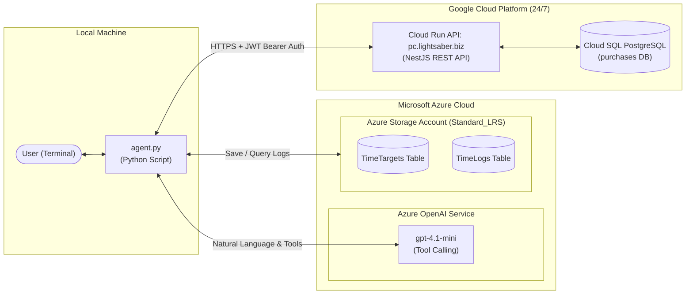

# Azure Time Tracker & Purchase-Calc AI Agent

An intelligent, conversational AI assistant that logs time spent on projects and integrates with **Purchase-Calc** (hosted 24/7 on **Google Cloud Run**). It logs time in natural language into **Azure Table Storage**, queries expenses, summarizes merchant spending, and manages tasks/todos.

---

## Architecture & How It Works



1. **Conversational Interface**: You chat with `agent.py` in natural language.
2. **Azure OpenAI Model**: Interprets intent and triggers backend functions/tools:
   - **Time Tracking (Azure Table Storage)**: `list_targets`, `create_target`, `log_time`, `get_summary`.
   - **Personal Finance & Tasks (GCP Cloud Run)**: `get_spending_summary`, `add_spending`, `list_todos`, `create_todo`, `toggle_todo`, `get_purchases`.
   - **Cross-Service Synergy**: `log_time_on_todo` (logs time in Azure against a purchase-calc task and optionally completes it on Cloud Run).

---

## Requirements

### 1. Does it need a model deployed on Azure?
**Yes.** 
The agent uses an Azure OpenAI chat model with **function calling (tool use)**:
- **Recommended Model**: `gpt-4.1-mini` or `gpt-4o-mini`.
- **Can it be created with Bicep?** **Yes!** You can deploy it using [`../infra/openai.bicep`](../infra/openai.bicep) or together with storage using [`../infra/main.bicep`](../infra/main.bicep).

### 2. Cloud Resources Required
| Resource | Provider | Purpose | Estimated Cost |
| :--- | :--- | :--- | :--- |
| **Azure Storage Account** | Azure | Stores `TimeTargets` and `TimeLogs` | **< $0.01 / month** (~$0.045/GB/month) |
| **Azure OpenAI Service** | Azure | AI agent reasoning and tool calling | **Pay-as-you-go** (fractions of a cent) |
| **Purchase-Calc API** | GCP Cloud Run | REST API for spending, budgets, todos | **24/7 Serverless** (free tier / minimal) |

---

## Installation & Setup

### 1. Install Python Dependencies
Create and activate your virtual environment, then install the required packages:

```powershell
# Create virtual environment
python -m venv .venv

# In PowerShell (Windows)
.\.venv\Scripts\Activate.ps1

# Install requirements
pip install -r requirements.txt
```

*(Packages used: `azure-data-tables`, `openai`, `python-dotenv`, `azure-identity`, `httpx`, `pyjwt`)*

### 2. Configure Environment Variables (`.env`)
Create or edit your `.env` file in the project root:

```env
# Azure OpenAI Service Configuration
AZURE_OPENAI_ENDPOINT="https://<your-openai-resource>.services.ai.azure.com/openai/v1"
AZURE_OPENAI_API_KEY="<your-azure-openai-api-key>"
AZURE_OPENAI_DEPLOYMENT_NAME="gpt-4.1-mini"

# Azure Storage Account Configuration
AZURE_STORAGE_CONNECTION_STRING="DefaultEndpointsProtocol=https;AccountName=<storage-account-name>;AccountKey=<key>;EndpointSuffix=core.windows.net"

# GCP Cloud Run Purchase-Calc Backend Configuration
PURCHASE_CALC_API_URL="https://pc.lightsaber.biz"
PURCHASE_CALC_BEARER_TOKEN="<your-jwt-bearer-token>"
PURCHASE_CALC_JWT_SECRET="<your-jwt-secret>"
PURCHASE_CALC_USER_EMAIL="antti.tolamo@gmail.com"
```

---

## Usage Guide

### 1. Test Storage & Cloud Run Connectivity
Run the test scripts:
```powershell
# Check Azure Table Storage
python test_storage.py

# Check GCP Cloud Run Purchase-Calc REST API
python test_purchase_integration.py
```

### 2. Start the Agent
Launch the interactive assistant:
```powershell
python agent.py
```

### 3. Example Conversations

#### Scenario A: Log time without a target
```text
You: 45 minutes
Agent: Great! What was this for? Here are your current targets:
1. Thing X
2. Website Redesign
Which of these was this for? Or if none of these fit, you can give me a new target name to create.
```

#### Scenario B: Query spending from Purchase-Calc
```text
You: How much did I spend this month?
Agent: In March 2026, you had 32 transactions totaling 482.15 EUR:
- S-market: 215.40 EUR
- Ravintola Hang Out: 84.50 EUR
- Hesburger: 32.20 EUR
- Other locations: 150.05 EUR
```

#### Scenario C: View and manage Todos
```text
You: What tasks do I have pending?
Agent: Here are your open tasks from Purchase-Calc:
1. #4: Tarkista omaposti onko energia lasku maksettu (Due: 2026-06-02)
```

#### Scenario D: Log time on a Todo and mark it done
```text
You: I spent 30 minutes on task #4 and finished it
Agent: Done!
- Logged 30 minutes on "Tarkista omaposti onko energia lasku maksettu" in Azure Table Storage.
- Marked task #4 as completed in Purchase-Calc.
```

#### Scenario E: View time tracking summary
```text
You: show time summary
Agent: Here is your logged time summary from Azure Table Storage:
- Thing X: 75 minutes (1.25 hours)
- Tarkista omaposti onko energia lasku maksettu: 30 minutes (0.50 hours)
Total time logged: 105 minutes across 2 targets.
```

---

## File Structure

```text
time_tracker_ai/
├── agent.py                      # Conversational agent (Azure OpenAI + dual tool dispatch)
├── storage.py                    # Azure Table Storage client (TimeTargets & TimeLogs)
├── purchase_client.py            # GCP Cloud Run REST API client (JWT Auth + HTTPS)
├── test_storage.py               # Storage connectivity check
├── test_purchase_integration.py  # Cloud Run API connectivity check
├── .env                          # API keys, connection strings, Cloud Run URL
├── requirements.txt              # Python dependencies
└── README.md                     # Documentation
```
