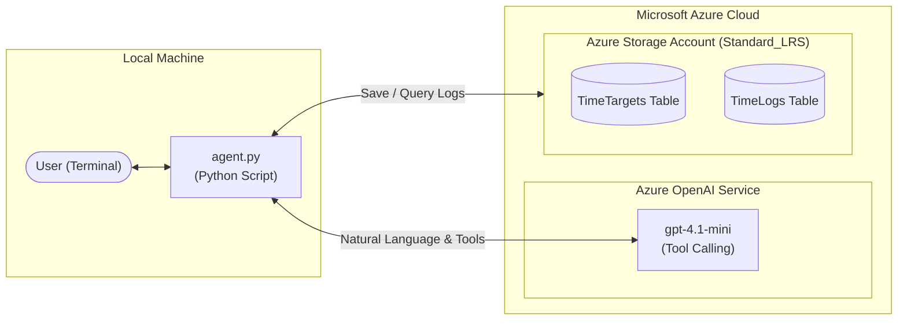

# Azure Time Tracker AI Agent

An intelligent, conversational AI assistant that logs time spent on projects and tasks. It takes inputs in natural language (e.g., minutes or hours), interactively suggests existing project targets, allows creating new targets on the fly, and persists all data to **Azure Table Storage**—the most cost-effective storage option in Azure.

---

## Architecture & How It Works



1. **Conversational Interface**: You chat with `agent.py` in natural language.
2. **Azure OpenAI Model**: The model interprets your request and triggers functions/tools:
   - `list_targets`: Retrieves existing targets from storage.
   - `create_target`: Creates a new project category.
   - `log_time`: Records the duration in minutes against the selected target.
   - `get_summary`: Calculates and aggregates hours and minutes across targets.
3. **Azure Table Storage**: Stores data in two lightweight, serverless tables (`TimeTargets` and `TimeLogs`).

---

## Requirements

### 1. Does it need a model deployed on Azure?
**Yes.** 
The agent uses a chat model that supports **function calling (tool use)** to interpret natural language, select targets, and trigger storage operations.
- **Recommended Model**: `gpt-4.1-mini` or `gpt-4o-mini`.
- **Cost**: `gpt-4.1-mini` is Azure's cheapest tier model (~$0.00015 per 1,000 tokens). Typical daily time logging costs less than a penny per month.
- **Can it be created with Bicep?** **Yes!** You can deploy it automatically using [`../infra/openai.bicep`](../infra/openai.bicep) or together with storage using [`../infra/main.bicep`](../infra/main.bicep).

### 2. Azure Cloud Resources Required
| Resource | SKU / Tier | Purpose | Estimated Cost |
| :--- | :--- | :--- | :--- |
| **Azure Storage Account** | `Standard_LRS` (StorageV2) | Stores `TimeTargets` and `TimeLogs` | **< $0.01 / month** (~$0.045/GB/month) |
| **Azure OpenAI Service** | `gpt-4.1-mini` | AI agent reasoning and tool calling | **Pay-as-you-go** (fractions of a cent) |
| **Resource Group** | N/A | Logical container for resources | **Free** |

### 3. Local Environment Requirements
- **Python**: Version 3.10 or newer (tested with Python 3.13).
- **Azure CLI**: Required if deploying infrastructure via Bicep (`az login`, `az bicep build`).

---

## Infrastructure Deployment (Bicep)

You can provision all required Azure cloud resources using the Bicep templates located in [`../infra/`](../infra/):

### Option 1: Deploy Everything Together (Storage + GPT Mini)
Deploys both the Azure Table Storage account and the Azure OpenAI `gpt-4.1-mini` model in one step:
```powershell
cd ..\infra
az deployment group create `
  --resource-group "<your-resource-group>" `
  --template-file "./main.bicep" `
  --parameters location="eastus2"
```

### Option 2: Deploy GPT Mini Model Only
If you already have a storage account and just need the OpenAI model:
```powershell
cd ..\infra
az deployment group create `
  --resource-group "<your-resource-group>" `
  --template-file "./openai.bicep" `
  --parameters location="eastus2"
```

### Option 3: Deploy Storage Account Only
```powershell
cd ..\infra
.\deploy.ps1 -ResourceGroupName "<your-resource-group>"
```

The deployment outputs all connection strings and keys directly in your terminal, ready to paste into your `.env` file.

---

## Installation & Setup

### 1. Install Python Dependencies
Activate your virtual environment and install the required packages:

```powershell
# In PowerShell (Windows)
.\.venv\Scripts\Activate.ps1

# Install requirements
pip install -r requirements.txt
```

*(Packages used: `azure-data-tables`, `openai`, `python-dotenv`, `azure-identity`)*

### 2. Configure Environment Variables (`.env`)
Create or edit your `.env` file in the project root with the following keys:

```env
# Azure OpenAI Service Configuration
AZURE_OPENAI_ENDPOINT="https://<your-openai-resource>.services.ai.azure.com/openai/v1"
AZURE_OPENAI_API_KEY="<your-azure-openai-api-key>"
AZURE_OPENAI_DEPLOYMENT_NAME="gpt-4.1-mini"

# Azure Storage Account Configuration (Cheapest Standard_LRS Table Storage)
AZURE_STORAGE_CONNECTION_STRING="DefaultEndpointsProtocol=https;AccountName=<storage-account-name>;AccountKey=<key>;EndpointSuffix=core.windows.net"
```


---

## Usage Guide

### 1. Test Storage Connectivity (Optional)
Run the test script to ensure tables are reachable:
```powershell
python test_storage.py
```

### 2. Start the Agent
Launch the interactive agent:
```powershell
python agent.py
```

### 3. Example Conversations

#### Scenario A: Log minutes without a target
```text
You: 45 minutes

Agent: Great! What was this for? Here are your current targets:
1. Thing X
2. Website Redesign

Which of these was this for? Or if none of these fit, you can give me a new target name to create.
```

#### Scenario B: Select an existing option or create a new target
```text
You: Option 1
# OR
You: Create new target "Azure AI Certification"

Agent: Created target "Azure AI Certification" and logged 45 minutes (0.75 hours). Your total time on Azure AI Certification is now 0.75 hours.
```

#### Scenario C: Log time and project in one prompt
```text
You: I spent 30 minutes on Thing X

Agent: Logged 30 minutes on Thing X. Your total on Thing X is now 1.25 hours (75 minutes).
```

#### Scenario D: View time summary
```text
You: show summary

Agent: Here is your logged time summary:
- Thing X: 75 minutes (1.25 hours)
- Azure AI Certification: 45 minutes (0.75 hours)

Total time logged: 120 minutes (2.00 hours) across 2 targets.
```

#### Scenario E: Exit
```text
You: quit
```

---

## File Structure

```text
├── infra/
│   ├── main.bicep            # All-in-one template (Storage + GPT Mini)
│   ├── openai.bicep          # Bicep template for Azure OpenAI & GPT Mini
│   ├── storage.bicep         # Bicep template for storage account & tables
│   ├── storage.bicepparam    # Bicep parameters file
│   ├── deploy.ps1            # Automated PowerShell deployment script
│   └── README.md             # Infrastructure documentation
├── time_tracker/
│   ├── agent.py              # Main conversational agent (Azure OpenAI + tools)
│   ├── storage.py            # Azure Table Storage client & table management
│   ├── test_storage.py       # Quick connectivity check script
│   └── README.md             # This documentation
├── .env                      # Application credentials & endpoints
└── requirements.txt          # Python dependencies
```

