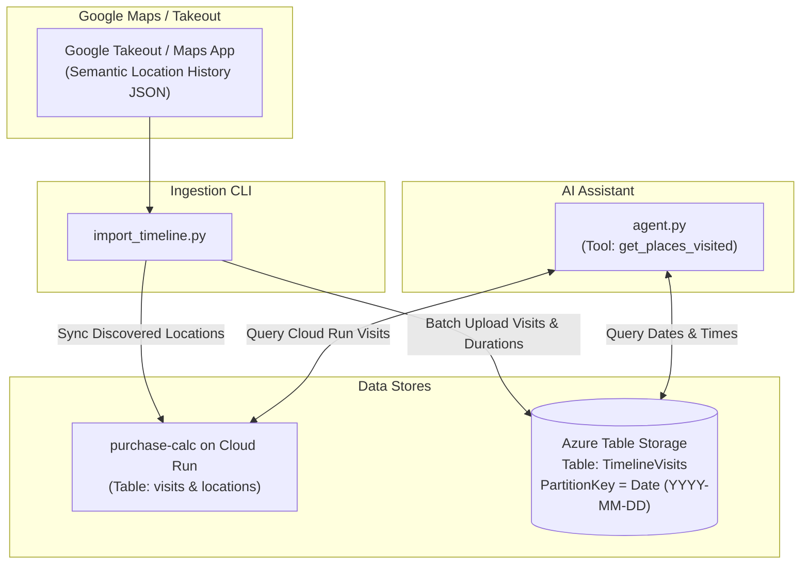

# Google Timeline Integration Guide

This guide documents the design, architecture, and step-by-step instructions for integrating **Google Maps Timeline** and location visit history into the **Time Tracker & Purchase-Calc AI Agent**.

---

## 1. Overview & Capabilities

By integrating Google Timeline data with the AI assistant, you can ask natural-language questions about your whereabouts, places visited, and time spent:

* *"Where was I on January 23rd, 2026?"*
* *"Which places or restaurants did I visit last week?"*
* *"How long did I stay at Fressi Clubhouse on January 6th?"*
* *"Did I visit S-market on Monday?"*

The agent can also cross-reference location visits with time tracking (e.g. logging project hours spent at a specific client location or office).

---

## 2. Architecture



### Dual-Storage Design:
1. **Azure Table Storage (`TimelineVisits`)**:
   - Google Timeline JSON records detailed arrival timestamps, departure timestamps, durations, and transit modes (e.g., walking, driving).
   - Stored in your Azure Storage Account (`tolahours`) in the `TimelineVisits` table.
   - Partitioned by `Date` (`YYYY-MM-DD`) for sub-millisecond queries.
2. **`purchase-calc` Cloud Run Backend (`visits` & `locations`)**:
   - Stores visits already logged via web or mobile apps.
   - The agent automatically queries both sources and merges the results.

---

## 3. How to Export Google Timeline Data

Google Timeline data can be exported in two ways:

### Option A: Google Takeout (Recommended for Bulk History)
1. Go to [Google Takeout](https://takeout.google.com/).
2. Deselect all products, then check **Location History (Timeline)**.
3. Choose format: **JSON**.
4. Create export and download the zip file.
5. Extract the archive. Look for the directory:
   `Takeout/Location History (Timeline)/Semantic Location History/YYYY/YYYY_MONTH.json`

### Option B: Google Maps Mobile App (iOS / Android)
In recent versions of Google Maps, timeline data is stored directly on your phone:
1. Open Google Maps on your phone.
2. Tap your profile icon → **Your Timeline**.
3. Tap the **three dots menu (...)** → **Settings and privacy**.
4. Scroll to **Location settings** → **Export Timeline data**.
5. Save or transfer the exported JSON file to your computer.

---

## 4. Google Timeline JSON Structure

Google Timeline exports use the **Semantic Location History** schema:

```json
{
  "timelineObjects": [
    {
      "placeVisit": {
        "location": {
          "latitudeE7": 602211660,
          "longitudeE7": 251385641,
          "placeId": "ChIJoWmvLmsPkkYRCxnAMeSDaV8",
          "address": "Mustalahdentie 10, 00960 Helsinki, Suomi",
          "name": "Ravintola Hang Out",
          "semanticType": "TYPE_SEARCHED_ADDRESS"
        },
        "duration": {
          "startTimestamp": "2026-01-23T16:45:00.000Z",
          "endTimestamp": "2026-01-23T18:45:24.291Z"
        },
        "placeConfidence": "HIGH_CONFIDENCE"
      }
    },
    {
      "activitySegment": {
        "startLocation": { "latitudeE7": 602211660, "longitudeE7": 251385641 },
        "endLocation": { "latitudeE7": 602236293, "longitudeE7": 251418162 },
        "duration": {
          "startTimestamp": "2026-01-23T18:45:24.291Z",
          "endTimestamp": "2026-01-23T19:05:00.000Z"
        },
        "activityType": "WALKING"
      }
    }
  ]
}
```

---

## 5. Ingestion Script (`import_timeline.py`)

### Command Usage:
```powershell
# Import a single monthly JSON export
python import_timeline.py --file "Takeout/Location History/Semantic Location History/2026/2026_JANUARY.json"

# Import an entire directory of yearly/monthly files
python import_timeline.py --dir "Takeout/Location History/Semantic Location History"

# Optionally sync newly discovered locations to purchase-calc Cloud Run
python import_timeline.py --file "2026_JANUARY.json" --sync-pcalc
```

### Key Behaviors:
* **Deduplication**: Generates deterministic RowKeys based on `YYYYMMDD_HHMMSS_<placeId>` so importing the same file multiple times will never duplicate records.
* **Duration Calculation**: Calculates arrival time, departure time, and duration in minutes for every place visit.
* **Coordinate Conversion**: Automatically converts integer `latitudeE7` / `longitudeE7` to standard float degrees (`/ 1e7`).

---

## 6. Conversational Agent Usage

Once data is imported (or using existing `purchase-calc` visits), the agent will automatically use the `get_places_visited` tool:

### Example Dialogue 1: Single Day Whereabouts
```text
You: Where was I on January 23rd, 2026?

Agent: On Friday, January 23rd, 2026, you visited 3 locations:
1. MorriSon's (10:52 AM)
2. Kodan (12:48 PM)
3. Ravintola Hang Out (Mustalahdentie 10) from 16:45 to 18:45 (2 hours)
```

### Example Dialogue 2: Checking Specific Locations
```text
You: Did I visit the gym anytime between Jan 15 and Jan 25?

Agent: Yes, you visited Fressi Clubhouse (Vuosaari) on:
- Thursday, January 22nd, 2026 at 14:58
```

### Example Dialogue 3: Cross-Referencing Time Tracking
```text
You: I worked while I was at Pasila Library on Jan 13th. Log 1.5 hours on "Research Project".

Agent: Understood!
- Verified your visit to Pasila Library on 2026-01-13 (10:05 AM).
- Logged 90 minutes (1.5 hours) on target "Research Project" into Azure Table Storage.
```

